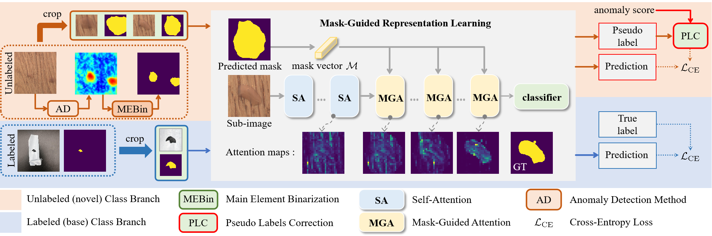

#  AnomalyNCD: Towards Novel Anomaly Class Discovery in Industrial Scenarios

**This is an official PyTorch implementation for "AnomalyNCD: Towards Novel Anomaly Class Discovery in Industrial Scenarios"**

Authors:  [Ziming Huang](https://github.com/ZimingHuang1)<sup>1*</sup> | [Xurui Li](https://github.com/xrli-U)<sup>1*</sup> | [Haotian Liu](https://github.com/xrli-U)<sup>1*</sup> | [Feng Xue](https://xuefeng-cvr.github.io/)<sup>3</sup> | [Yuzhe Wang](https://github.com/YuzheWang888)<sup>1</sup> | [Yu Zhou](https://github.com/zhouyu-hust)<sup>1,2</sup>

Institutions: <sup>1</sup>Huazhong University of Science and Technology | <sup>2</sup>Wuhan JingCe Electronic Group Co.,LTD | <sup>3</sup>University of Trento

### 🧐 [Arxiv](https://arxiv.org/pdf/2410.14379.pdf) | [OpenReview](https://openreview.net/forum?id=PNmlWDgJyH)

## 📣Updates:
***09/01/2025***

We have updated the code for standalone inference. Run the `scripts/anomalyncd_test.sh` script to load the trained checkpoint and perform inference.

***04/01/2025***

The complete code of our method **AnomalyNCD** in [paper](https://arxiv.org/pdf/2410.14379.pdf) is released.

<span id='all_catelogue'/>

## Catalogue

* <a href='#abstract'>1. Abstract</a>
* <a href='#setup'>2. Environment setup</a>
* <a href='#datasets'>3. Datasets</a>
  * <a href='#datasets_mvtec_ad'>MVTec AD</a>
  * <a href='#datasets_mtd'>MTD</a>
  * <a href='#datasets_aebad'>AeBAD</a>
* <a href='#gen_ano_map'>4. Get Anomaly Maps </a>
* <a href='#quick_use'>5. Run AnomalyNCD </a>
* <a href='#results_datasets'>6. Results </a>
* <a href='#citation'>7. Citation</a>
* <a href='#thanks'>8. Acknowledgements</a>
* <a href='#license'>9. License</a>

<span id='abstract'/>

## Abstract: <a href='#all_catelogue'>[Back to Catalogue]</a>

Recently, multi-class anomaly classification has garnered increasing attention.
Previous methods directly cluster anomalies but often struggle due to the lack of anomaly-prior knowledge.
Acquiring this knowledge faces two issues: the non-prominent and weak-semantics anomalies.
In this paper,
we propose AnomalyNCD,
a multi-class anomaly classification network compatible with different anomaly detection methods.

To address the non-prominence of anomalies,
we design main element binarization (MEBin) to obtain anomaly-centered images,
ensuring anomalies are learned while avoiding the impact of incorrect detections.
Next, to learn anomalies with weak semantics,
we design mask-guided representation learning,
which focuses on isolated anomalies guided by masks
and reduces confusion from erroneous inputs through re-corrected pseudo labels.
Finally, to enable flexible classification at both region and image levels,
we develop a region merging strategy that determines the overall image category based on the classified anomaly regions.

Our method outperforms the state-of-the-art works on the MVTec AD and MTD datasets.
Compared with the current methods,
AnomalyNCD combined with zero-shot anomaly detection method achieves a 10.8\% $F_1$ gain, 8.8\% NMI gain, and 9.5\% ARI gain on MVTec AD, and 12.8\% $F_1$ gain,
5.7\% NMI gain, and 10.8\% ARI gain on MTD.


 

<span id='setup'/>

## Setup: <a href='#all_catelogue'>[Back to Catalogue]</a>
### Environment:
- Python 3.8
- CUDA 11.8
- PyTorch 1.9.0
  
Clone the repository:

```
git clone https://github.com/HUST-SLOW/AnomalyNCD.git
```

Create virtual environment:

```
conda create --name AnomalyNCD python=3.8
conda activate AnomalyNCD
```

Install the required packages:

```
conda install pytorch==1.9.0 torchvision==0.10.0 pytorch-cuda=11.8 -c pytorch -c nvidia
pip install -r requirements.txt
```

<span id='datasets'/>

## Datasets: <a href='#all_catelogue'>[Back to Catalogue]</a>
We conduct the multi-class anomaly classification on industrial datasets MVTec AD [(download)](https://www.mvtec.com/company/research/datasets/mvtec-ad/) and Magnetic Tile Defect [(download)](https://github.com/abin24/Magnetic-tile-defect-datasets.).

For the labeled abnormal image set $\mathcal{D^\mathbf{l}}$, we use Aero-engine Blade Anomaly Detection Dataset (AeBAD) [(download)](https://github.com/zhangzilongc/MMR).

All the datasets are placed under the `./data` folder.

<span id='datasets_mvtec_ad'/>

### [MVTec AD](https://www.mvtec.com/company/research/datasets/mvtec-ad/)

```
data
|-- mvtec_anomaly_detection
|-----|-- bottle
|-----|-----|-- train
|-----|-----|-----|-- good
|-----|-----|-----|-----|-- 000.png
|-----|-----|-----|-----|-- 001.png
|-----|-----|-----|-----|-- ...
|-----|-----|-- test
|-----|-----|-----|-- broken_large
|-----|-----|-----|-----|-- 000.png
|-----|-----|-----|-----|-- 001.png
|-----|-----|-----|-----|-- ...
|-----|-----|-----|-- broken_small
|-----|-----|-----|-- ...
|-----|-----|-- ground_truth
|-----|-----|-----|-- broken_large
|-----|-----|-----|-----|-- 000_mask.png
|-----|-----|-----|-----|-- 001_mask.png
|-----|-----|-----|-----|-- ...
|-----|-----|-----|-- broken_small
|-----|-----|-----|-- ...
|-----|-- cable
|-----|-- ...
```

<span id='datasets_mtd'/>

### [Magnetic Tile Defect (MTD)](https://github.com/abin24/Magnetic-tile-defect-datasets.)

Following PatchCore and DifferNet, we split the original MTD dataset into a training set and a test set.
For details, please refer to [link](https://github.com/marco-rudolph/differnet/tree/master) to obtain the file ```mtd_train_filenames.txt```.To process the MTD dataset, you need to set ```train_txt``` in the script ```python datasets/mtd_preprocess.py``` and then run this script.
```
python datasets/mtd_preprocess.py
```
This script will transform the MTD dataset into the following structure.
```
data
|-- mtd_anomaly_detection
|-----|-- train
|-----|-----|-- MT_Free
|-----|-----|-----|-- exp1_num_10181.jpg
|-----|-----|-----|-- exp1_num_10334.jpg
|-----|-----|-----|-- ...
|-----|-- test
|-----|-----|-- MT_Blowhole 
|-----|-----|-----|-- exp1_num_108719.jpg
|-----|-----|-----|-- exp1_num_108889.jpg
|-----|-----|-----|-- ...
|-----|-----|-- MT_Break
|-----|-----|-----|-- ...
|-----|-- ground_truth
|-----|-----|-- MT_Blowhole
|-----|-----|-----|-- exp1_num_108719.png
|-----|-----|-----|-- exp1_num_108889.png
|-----|-----|-----|-- ...
|-----|-----|-- MT_Break
|-----|-----|-----|-- ...
```


<span id='datasets_aebad'/>

### [Aero-engine Blade Anomaly Detection Dataset (AeBAD)](https://github.com/zhangzilongc/MMR)

We use the sub-dataset AeBAD-S in AeBAD datasets as the labeled abnormal image set $\mathcal{D^\mathbf{l}}$.
It contains four anomaly classes: breakdown, ablation, fracture, and groove.

The AeBAD dataset needs to be processed by running the script ```python datasets/aebad_preprocess.py``` to preform cropping and obtain the sub-images.
```
python datasets/aebad_preprocess.py
```
We also provide the processed dataset `AeBAD_crop` [(drive)](https://drive.google.com/file/d/1GeisrpSKOIU3nRp5dZ-W3hRDlT5AP9aA/view?usp=drive_link).

<span id='gen_ano_map'/>

## Get Anomaly Maps: <a href='#all_catelogue'>[Back to Catalogue]</a>

Our AnomalyNCD could receive anomaly maps output from any anomaly detection (AD) method as input.
To accurately implement the results in our paper, we provide download links to anomaly maps output by some typical anomaly detection methods below.

 AD method | [MuSc](https://github.com/xrli-U/MuSc) | [PatchCore](https://arxiv.org/abs/2106.08265) | [EfficientAD](https://arxiv.org/abs/2303.14535) | [RD++](https://openaccess.thecvf.com/content/CVPR2023/papers/) | [PNI](http://export.arxiv.org/abs/2211.12634) | [CPR](https://arxiv.org/abs/2308.06748) |
| :---:     |   :---:    |  :---: |  :---:  |  :---:  |  :---:  |  :---:  |
| __MVTec AD__ | [(drive)](https://drive.google.com/file/d/1gcLmnZ6yD6USIcqjvXGmvADBiOFZ3eC5/view?usp=drive_link) | [(drive)](https://drive.google.com/file/d/1J6LftfGJiqclLc3JDxwdKuRrAem8NRTO/view?usp=drive_link) | [(drive)](https://drive.google.com/file/d/1ttQWiApCTqzQYekzPcmSaTxRyleJiKvR/view?usp=drive_link) | [(drive)](https://drive.google.com/file/d/15Tze9gVptlpAIiEP9hKap0JF20uvPPmY/view?usp=drive_link) | [(drive)](https://drive.google.com/file/d/1UQV-iMEJo0Bxv5srktK89xcphcnHOvqV/view?usp=drive_link) | [(drive)](https://drive.google.com/file/d/1BhQUX7QjPuRE3QLMFJncg2Url8uoOVJb/view?usp=drive_link) |
| __MTD__ | [(drive)](https://drive.google.com/file/d/1PcwWgwEWU2Dq97pFe140nF7EBkuE1dIr/view?usp=drive_link) | [(drive)](https://drive.google.com/file/d/1AV7lKQFilXYU2nmn_83LHmx-55xXMdjV/view?usp=drive_link) | [(drive)](https://drive.google.com/file/d/1Qbm2I-mlhPJb9uJvM2-hGgoguwriDXbN/view?usp=drive_link) | [(drive)](https://drive.google.com/file/d/1mq1VirFqkW0ZUxBI0SzqNz_hkMEqCAd-/view?usp=drive_link) | [(drive)](https://drive.google.com/file/d/1xrFb26LNwHlQ1sOPY--R_EW3QOGbGdS3/view?usp=drive_link) | - |

In order to be compatible with more custom anomaly detection methods, we provide the following code to save anomaly maps.
Note that all datasets need to be pre-processed to the structure of the MVTec AD dataset.

<!-- We provide these anomaly maps [(download)](https://drive.google.com/drive/folders/1EMM52bv2VhwnajQ0YxOSIejjz7OKqZvu?usp=sharing) to accurately implement the results in our paper. -->

<!-- We also provide the code for generating anomaly maps. Please input the original image paths and their corresponding anomaly maps. -->

```
def generate_anomaly_maps(image_paths, anomaly_maps, output_dir):
    """
    image_paths (list): List of image paths
    anomaly_maps (torch.Tensor): Anomaly maps from AD method
    output_dir (str): The directory that saves the anomaly maps
    """
    def normalization01(imgs):
        return (imgs - imgs.min()) / (imgs.max() - imgs.min())

    anomaly_maps_norm = normalization01(anomaly_maps)

    for i, path in enumerate(image_paths):
        anomaly_type = path.split('/')[-2]
        img_name = path.split('/')[-1]
        category = path.split('/')[-4]

        save_path = os.path.join(output_dir, category, anomaly_type)
        os.makedirs(save_path, exist_ok=True)
        save_path = os.path.join(save_path, img_name)
        anomaly_map = anomaly_maps_norm[i]*255
        cv2.imwrite(save_path, anomaly_map.astype(np.uint8))
```

We use MuSc as an example to describe how the above code can be used to save anomaly maps.


```
# Code from [MuSc](https://github.com/xrli-U/MuSc/blob/main/models/musc.py)

print('computing metrics...')
pr_sp = np.array(scores_cls)
gt_sp = np.array(gt_list)
gt_px = torch.cat(img_masks, dim=0).numpy().astype(np.int32)
pr_px = np.array(anomaly_maps)
image_metric, pixel_metric = compute_metrics(gt_sp, pr_sp, gt_px, pr_px)
auroc_sp, f1_sp, ap_sp = image_metric
auroc_px, f1_px, ap_px, aupro = pixel_metric

"""
Basically the code will provide the three parameters we need, 
you need to find image_paths and category in code.
"""

# our code to generate anomaly maps
save_dir = 'mvtec_ad_anomaly_map'
generate_anomaly_maps(image_path_list, pr_px, save_dir)
```


The anomaly maps on the MVTec AD dataset are stored according to the following structure.
```
data
|-- mvtec_ad_anomaly_map
|-----|-- bottle
|-----|-----|-- broken_large
|-----|-----|-----|-- 000.png
|-----|-----|-----|-- 001.png
|-----|-----|-----|-- ...
|-----|-----|-- broken_small
|-----|-----|-- ...
|-----|-- cable
|-----|-- ...
```

<span id='quick_use'/>

## Run AnomalyNCD: <a href='#all_catelogue'>[Back to Catalogue]</a>
Run the training script:
```
bash scripts/anomalyncd.sh
```

The key arguments of the script are as follows:

- ``gpu``: The gpu id for training.

- ``runner_name``: The name of experiment. 

- ``dataset``: The name of the novel(unlabeled) image dataset.

- ``category``: The product name of novel(unlabeled) images $\mathcal{D^\mathbf{u}}$.

- ``dataset_path``: The directory path of novel(unlabeled) images.

- ``anomaly_map_path``: The directory path of novel(unlabeled) anomaly maps.

- ``binary_data_path``: The output path of binarization results of novel(unlabeled) images.

- ``crop_data_path``: The output path of novel(unlabeled) sub-images and corresponding masks.

- ``base_data_path``: The directory path of base(labeled) abnormal images $\mathcal{D^\mathbf{l}}$.


All checkpoints and metrics will be stored in the `./outputs/<RUN_EXP>`.

<span id='results_datasets'/>

## Results: <a href='#all_catelogue'>[Back to Catalogue]</a>
We report the quantitative results on the MVTec AD and MTD datasets.
All the results are implemented by the default settings in our paper.

### Unsupervised multi-class classification
| Datasets | Metric | [IIC](https://arxiv.org/pdf/1807.06653)   | [GATCluster](https://arxiv.org/pdf/2002.11863) | [SCAN](https://arxiv.org/pdf/2005.12320)  | [UNO](https://arxiv.org/abs/2108.08536)   | [GCD](https://arxiv.org/abs/2201.02609)   | [SimGCD](https://openaccess.thecvf.com/content/ICCV2023/papers/Wen_Parametric_Classification_for_Generalized_Category_Discovery_A_Baseline_Study_ICCV_2023_paper.pdf) | [AMEND](https://openaccess.thecvf.com/content/WACV2024/papers/Banerjee_AMEND_Adaptive_Margin_and_Expanded_Neighborhood_for_Efficient_Generalized_Category_WACV_2024_paper.pdf) | [AC (Unsup.)](https://openaccess.thecvf.com/content/WACV2023/papers/Sohn_Anomaly_Clustering_Grouping_Images_Into_Coherent_Clusters_of_Anomaly_Types_WACV_2023_paper.pdf)       | [MuSc](https://arxiv.org/pdf/2401.16753.pdf) +AnomalyNCD      |
|----------|--------|-------|------------|-------|-------|-------|--------|-------|----------|----------|
| MVTec AD | NMI    | 0.093 | 0.136      | 0.210  | 0.146 | 0.417 | 0.452  | 0.431 | 0.525    | **0.613**    |
|          | ARI    | 0.020  | 0.053      | 0.103 | 0.052 | 0.302 | 0.346  | 0.333 | 0.431    | **0.526**    |
|          | F1     | 0.285 | 0.264      | 0.335 | 0.342 | 0.553 | 0.569  | 0.542 | 0.604    | **0.712**    |
|          | AUPRO  | -     | -          | -     | -     | -     | -      | -     | -        | 0.938    |
| MTD      | NMI    | 0.064 | 0.028      | 0.041 | 0.034 | 0.211 | 0.105  | 0.138 | 0.179    | **0.268**    |
|          | ARI    | 0.020  | 0.009      | 0.029 | 0.011 | 0.115 | 0.048  | 0.067 | 0.120     | **0.228**    |
|          | F1     | 0.252 | 0.243      | 0.282 | 0.221 | 0.381 | 0.293  | 0.324 | 0.346    | **0.509**    |
|          | AUPRO  | -     | -          | -     | -     | -     | -      | -     | -        | **0.769**    |

### Semi-supervised multi-class classification
| Datasets | Metric | [AC (Semi-sup.)](https://openaccess.thecvf.com/content/WACV2023/papers/Sohn_Anomaly_Clustering_Grouping_Images_Into_Coherent_Clusters_of_Anomaly_Types_WACV_2023_paper.pdf)          | [UniFormaly](https://arxiv.org/abs/2307.12540) | [PatchCore](https://arxiv.org/abs/2106.08265) +AnomalyNCD | [RD++](https://openaccess.thecvf.com/content/CVPR2023/papers/Tien_Revisiting_Reverse_Distillation_for_Anomaly_Detection_CVPR_2023_paper.pdf) +AnomalyNCD   | [EfficientAD](https://arxiv.org/abs/2303.14535) +AnomalyNCD | [PNI](http://export.arxiv.org/abs/2211.12634) +AnomalyNCD     | [CPR](https://arxiv.org/abs/2308.06748) +AnomalyNCD     |
|----------|--------|-------------|------------|-----------|---------|-------------|---------|----------|
| MVTec AD | NMI    | 0.608       | 0.547      | 0.670      | 0.631   | 0.516       | 0.675   | **0.736**    |
|          | ARI    | 0.489       | 0.433      | 0.601     | 0.542   | 0.394       | 0.609   | **0.674**    |
|          | F1     | 0.652       | 0.645      | 0.769     | 0.721   | 0.641       | 0.769   | **0.805**    |
|          | AUPRO  | -           | 0.953      | 0.938     | 0.950    | 0.917       | 0.942   | 0.964    |
| MTD      | NMI    | 0.390        | **0.421**      | 0.380      | 0.368   | 0.220        | 0.181   | -        |
|          | ARI    | 0.314       | 0.322      | **0.390**      | 0.361   | 0.188       | 0.219   | -        |
|          | F1     | 0.490        | 0.609      | **0.617**     | 0.600     | 0.467       | 0.465   | -        |
|          | AUPRO  | -           | 0.837      | 0.729     | 0.741   | 0.731       | 0.516   | -        |

### Results for each category on the MVTec dataset
|            |  |   [MuSc](https://arxiv.org/pdf/2401.16753.pdf)+AnomalyNCD    |       |  |   [CPR](https://arxiv.org/abs/2308.06748)+AnomalyNCD    |        |
|------------|:---------:|:-----:|:-----:|:--------:|:-----:|:------:|
| category   | NMI       | ARI   | F1    | NMI      | ARI   | F1     |
| bottle     | 0.613     | 0.583 | 0.819 | 0.904    | 0.775 | 0.757  |
| cable      | 0.597     | 0.492 | 0.626 | 0.561    | 0.711 | 0.476  |
| capsule    | 0.445     | 0.335 | 0.591 | 0.674    | 0.549 | 0.438  |
| carpet     | 0.852     | 0.837 | 0.906 | 0.795    | 0.740 | 0.638  |
| grid       | 0.622     | 0.578 | 0.731 | 0.731    | 0.766 | 0.689  |
| hazelnut   | 0.662     | 0.582 | 0.718 | 0.827    | 0.723 | 0.727  |
| leather    | 0.863     | 0.838 | 0.911 | 0.895    | 0.865 | 0.827  |
| metal_nut  | 0.643     | 0.467 | 0.565 | 0.930    | 0.870 | 0.848  |
| pill       | 0.439     | 0.291 | 0.513 | 0.747    | 0.694 | 0.592  |
| screw      | 0.399     | 0.265 | 0.488 | 0.800    | 0.742 | 0.698  |
| tile       | 0.885     | 0.850 | 0.940 | 0.992    | 0.980 | 0.976  |
| toothbrush | 0.368     | 0.259 | 0.762 | 0.857    | 0.508 | 0.499  |
| transistor | 0.531     | 0.421 | 0.620 | 0.700    | 0.577 | 0.523  |
| wood       | 0.743     | 0.672 | 0.868 | 0.912    | 0.816 | 0.756  |
| zipper     | 0.526     | 0.417 | 0.615 | 0.756    | 0.726 | 0.667  |
| mean       | 0.613     | 0.526 | 0.712 | 0.805    | 0.736 | 0.674  |


<span id='citation'/>

## Citation: <a href='#all_catelogue'>[Back to Catalogue]</a>

If you find this repo useful for your research, please consider citing our paper:

```
@inproceedings{huang2025anomalyncd,
  title={AnomalyNCD: Towards Novel Anomaly Class Discovery in Industrial Scenarios},
  author={Huang, Ziming and Li, Xurui and Liu, Haotian and Xue, Feng and Wang, Yuzhe and Zhou, Yu},
  booktitle={Proceedings of the IEEE/CVF Conference on Computer Vision and Pattern Recognition},
  year={2025}
}
```

<span id='thanks'/>

## Acknowledgements: <a href='#all_catelogue'>[Back to Catalogue]</a>

The codebase is built on repos: https://github.com/CVMI-Lab/SimGCD and https://github.com/sgvaze/generalized-category-discovery.

<span id='license'/>

## License: <a href='#all_catelogue'>[Back to Catalogue]</a>

AnomalyNCD is released under the **MIT Licence**, and is fully open for academic research and also allow free commercial usage. To apply for a commercial license, please contact yuzhou@hust.edu.cn.
